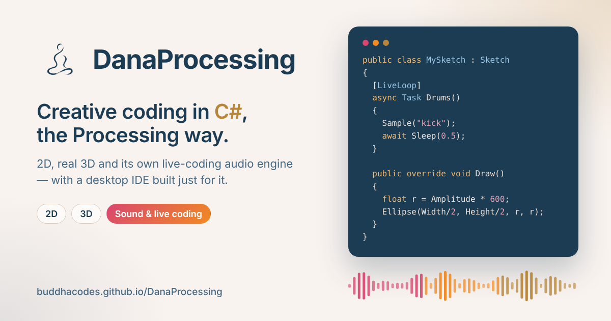

<p align="center">
  
</p>

<h1 align="center">DanaProcessing</h1>

<p align="center">
  <b>Creative coding in C#, the Processing way.</b><br>
  2D, real 3D and a live-coding audio engine, with a desktop IDE built just for sketching.
</p>

<p align="center">
  <a href="https://github.com/BuddhaCodes/DanaProcessing/actions/workflows/build-release.yml"></a>
  <a href="https://dotnet.microsoft.com/"></a>
  <a href="#-getting-started"></a>
  <a href="LICENSE.txt"></a>
  <a href="https://buddhacodes.github.io/DanaProcessing/"></a>
</p>

<p align="center">
  <a href="https://buddhacodes.github.io/DanaProcessing/"><b>Documentation</b></a> ·
  <a href="#-getting-started"><b>Download</b></a> ·
  <a href="#-live-coded-sound"><b>Sound</b></a> ·
  <a href="#-support-the-project"><b>Support</b></a>
</p>

<p align="center">
  <a href="https://buddhacodes.github.io/DanaProcessing/"></a>
</p>

<!-- A short GIF of the IDE (edit a sketch, press Run, see it change) would go great right here. -->

## ✨ Why it exists

I started programming with Java and JavaScript following [The Coding Train](https://www.youtube.com/@TheCodingTrain), sketching in [Processing](https://processing.org) and [p5.js](https://p5js.org). When I moved to C#, I wanted that same experience and couldn't find it, so I built it.

DanaProcessing borrows Processing's vocabulary on purpose: `Setup()`, `Draw()`, `Fill()`, `Rect()`, `Translate()`, `PVector`, `Noise()`. If you've written a Processing sketch, you can already read one of these. Then it adds what C# and .NET make possible: a real IDE, any NuGet package as a library, real 3D, and its own sound engine.

## 🎨 A sketch is this small

```csharp
public class MySketch : Sketch
{
    private float angle;

    public override void Setup() => Size(800, 600);

    public override void Draw()
    {
        Background(20, 20, 30);
        Translate(Width / 2f, Height / 2f);
        Rotate(angle += 1f);
        Fill(255, 150, 90);
        NoStroke();
        Rect(-100, -100, 200, 200);
    }
}
```

<details>
<summary><b>Same idea in 3D</b>: change one word</summary>

```csharp
public class MySketch : Sketch
{
    private float angle;

    public override void Setup() => Size(800, 600, RendererKind.Renderer3D);

    public override void Draw()
    {
        Background(20, 20, 30);
        Lights();
        Translate(Width / 2f, Height / 2f, 0);
        RotateY(angle += 0.02f);
        Fill(255, 150, 90);
        Box(200);
    }
}
```

Real geometry, real lighting, no separate engine to learn.
</details>

## 🎵 Live-coded sound

A music engine inspired by [Sonic Pi](https://sonic-pi.net), written from scratch in C# and running inside the sketch, so what you hear and what you draw share one clock. Mark a method as a `[LiveLoop]` and it repeats in time with the others. Edit it and press **Run**: the music doesn't stop, and each loop picks up the new code on its next pass.

```csharp
[LiveLoop]
async Task Drums()
{
    Sample("kick");
    await Sleep(1);
    Sample("kick");
    Sample("snare");
    await Sleep(1);
}

[LiveLoop]
async Task Bass()
{
    UseSynth(Synth.Saw);
    Play("E2", release: 0.3, cutoff: 80);
    await Sleep(0.5);
}

public override void OnNote(NoteEvent e)
{
    if (e.Sample == "kick") flash = 1;   // fires the moment the kick is heard
}
```

Synths, drums, `.wav` samples, envelopes, filters, and `Amplitude` / `Spectrum()` to drive your visuals. Sound currently plays on Windows; on macOS and Linux the loops and visuals run on the same clock, silently for now.

## 🧰 What you get

| | |
| --- | --- |
| 🖥️ **An IDE that knows your sketch** | Live Roslyn diagnostics as you type, autocomplete for the whole API, go-to-definition, and a **Run** that compiles in memory in well under a second. |
| 🔥 **Hot reload that keeps state** | Tweak a value in a particle system you've been tuning for ten minutes and it keeps running, instead of starting over from `Setup()`. |
| 🧊 **One API, two renderers** | 2D on SkiaSharp, real 3D on OpenGL (Silk.NET) with lights, cameras, materials, custom shaders and 200,000 GPU particles. |
| 📦 **Any NuGet package as a library** | Put `// nuget: PackageName, 1.2.3` at the top of a sketch and it's downloaded and linked. No `.csproj` to touch. |
| 🔊 **Live-coded sound** | Live loops, synths, drums and samples, with visuals that react on the beat. |
| 🗂️ **36 examples, searchable** | From a minimal sketch to orbit cameras, ML.NET models that learn while you click, MIDI/OSC and a live-coded beat. Search by name, topic or a function in the code. |
| 🚀 **Ship it as an app** | Export any sketch as a single, self-contained, double-clickable executable. |
| 🌎 **English and Spanish** | The whole interface is localized and switchable from Settings. |

## 🚀 Getting started

**Just want to draw something?** Grab the latest build. It's self-contained, nothing to install:

**[Windows](https://github.com/BuddhaCodes/DanaProcessing/releases/latest/download/DanaProcessingIde-win-x64.zip)** · **[macOS (Apple Silicon)](https://github.com/BuddhaCodes/DanaProcessing/releases/latest/download/DanaProcessingIde-osx-arm64.zip)** · **[macOS (Intel)](https://github.com/BuddhaCodes/DanaProcessing/releases/latest/download/DanaProcessingIde-osx-x64.zip)** · **[Linux](https://github.com/BuddhaCodes/DanaProcessing/releases/latest/download/DanaProcessingIde-linux-x64.tar.gz)**

The builds aren't code-signed yet (that costs real money on every platform), so your OS will ask if you're sure the first time. That's expected:

<details>
<summary><b>Windows</b>: SmartScreen</summary>

1. Right-click the downloaded `.zip` → **Properties** → check **Unblock** → **OK** (or run `Unblock-File .\DanaProcessingIde-win-x64.zip` in PowerShell). Do this *before* extracting.
2. Extract the zip and run `DanaProcessing.Ide.exe`, then press **Run** on the sketch that's already open.

If you extracted first and still see the prompt: **More info → Run anyway**.
</details>

<details>
<summary><b>macOS</b>: Gatekeeper</summary>

1. Unzip and try opening **DanaProcessing IDE.app**. macOS will say it can't verify the developer.
2. Go to **System Settings → Privacy & Security**, click **Open Anyway** next to DanaProcessing IDE, then confirm **Open**. macOS remembers this afterwards.
</details>

<details>
<summary><b>Linux</b>: execute bit</summary>

```bash
tar -xzf DanaProcessingIde-linux-x64.tar.gz
chmod +x DanaProcessing.Ide
./DanaProcessing.Ide
```

A `DanaProcessing.desktop` file is included if you want it in your app launcher; see the comment at the top of that file.
</details>

**Building from source?** You'll need the [.NET 8 SDK](https://dotnet.microsoft.com/download):

```bash
git clone https://github.com/BuddhaCodes/DanaProcessing.git
cd DanaProcessing
dotnet run --project DanaProcessing.Ide
```

## 📚 Documentation

The full reference, method by method, lives at **[buddhacodes.github.io/DanaProcessing](https://buddhacodes.github.io/DanaProcessing/)**, with separate views for 2D, 3D and Sound. It's also in [`index.html`](index.html) if you prefer to open it locally.

## 🏗️ What's in the repository

```text
DanaProcessing/                The core library: Sketch, Setup()/Draw(), 2D (SkiaSharp) and
                               3D (Silk.NET/OpenGL) rendering, the audio engine, PVector,
                               PImage, PGraphics, PShader, collections, math.

DanaProcessing.AvaloniaHost/   A cross-platform Avalonia control that hosts a running Sketch,
                               the canvas both the IDE and exported apps are built on.

DanaProcessing.Ide/            The desktop IDE: editor, live diagnostics, hot reload, NuGet
                               management, example gallery, exporter, settings, localization.
```

<details>
<summary><b>Under the hood</b></summary>

| | |
| --- | --- |
| Language / runtime | C# on .NET 8 |
| UI framework | [Avalonia UI](https://avaloniaui.net/) |
| 2D rendering | [SkiaSharp](https://github.com/mono/SkiaSharp) |
| 3D rendering | [Silk.NET](https://github.com/dotnet/Silk.NET) over OpenGL |
| Audio | Own engine in C#: logical-time scheduler, allocation-free audio thread, `winmm` output on Windows |
| In-IDE compilation | Roslyn (`Microsoft.CodeAnalysis`), in memory, no disk round-trip |
| Package resolution | `NuGet.Protocol`, straight from `// nuget:` comments |
</details>

## 🗺️ Roadmap

Where it's headed is in [`ROADMAP.md`](ROADMAP.md): hot reload on save, cross-platform builds, GPU particle systems and more.

## 💛 Support the project

DanaProcessing is free, open source, and built in spare time. If it's useful to you, for your art, your classes or your installations, you can help it keep growing with a donation via **[PayPal](https://paypal.me/CarlosFernandez934)**. Every contribution turns into more time for new features, examples and fixes.

> **A note on where donations go:** PayPal isn't available where I live, so donations are received on my behalf by a trusted collaborator, **Carlos Fernandez**. That's the name you'll see on the PayPal page.

*¿Hablás español? DanaProcessing es gratis y de código abierto; si te sirve, podés apoyarlo con una donación por [PayPal](https://paypal.me/CarlosFernandez934). Como PayPal no está disponible donde vivo, las donaciones las recibe en mi nombre un colaborador de confianza, Carlos Fernandez.*

You'll also find the link inside the IDE under **Help → Support the project**.

## 🤝 Contributing

Issues and pull requests are welcome: a bug, a new example sketch, or an idea for the API. If you build something with DanaProcessing, open an issue and show it off. I'd love to see it.

## 🙏 Inspiration

This project stands on the shoulders of [Processing](https://processing.org) and [p5.js](https://p5js.org), whose API it deliberately mirrors (some examples are adaptations of p5.js classics); [The Coding Train](https://www.youtube.com/@TheCodingTrain), where I learned to sketch; and [Sonic Pi](https://sonic-pi.net), whose way of live coding music shaped the audio engine.

## 📄 License

[MIT](LICENSE.txt). Do pretty much anything with it, just keep the notice.
